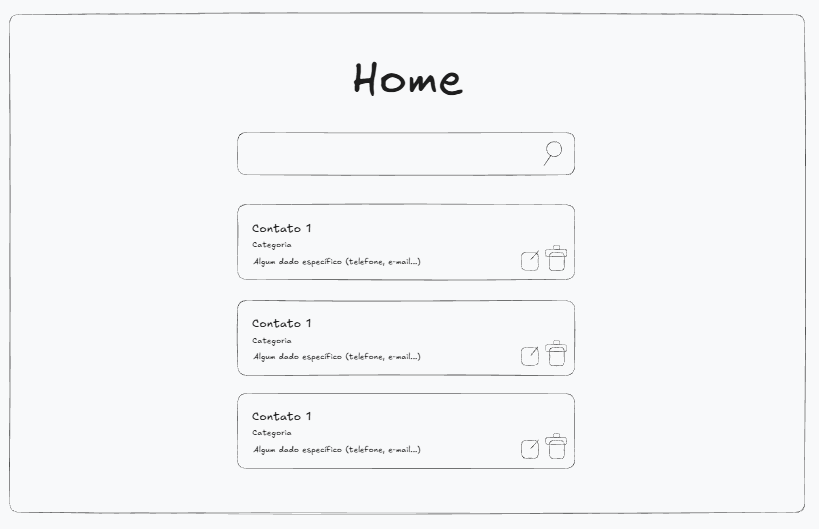

# **CSI606-2025-02 - Turma 23 - Proposta de Trabalho Final**

## *Matheus Lopes - 20.2.8002*

### Resumo

  O projeto será um sistema web desenvolvido para gerenciar contatos pessoais de forma simples e eficiente. A aplicação deve permitir armazenar informações detalhadas de contatos, organizados por categorias. Será construída utilizando tecnologias modernas como React no front-end, Node.js na API e PostgreSQL como banco de dados, com toda a infraestrutura em um container via Docker.

### 1. Tema

  O trabalho final tem como tema o desenvolvimento de um sistema web full-stack para gerenciamento de contatos pessoais, implementando uma arquitetura cliente-servidor com banco de dados relacional.

### 2. Escopo

  Este projeto terá as seguintes funcionalidades:
  
  - Cadastro, listagem, edição e exclusão de contatos (CRUD completo)
  - Organização de contatos por categorias personalizadas
  - Armazenamento de dados pessoais dos contatos (nome, telefone, e-mail, etc.)
  - Interface responsiva e intuitiva desenvolvida em React
  - API RESTful construída do zero com Node.js e Express
  - Persistência de dados em banco PostgreSQL
  - Containerização da aplicação com Docker

### 3. Restrições

   Neste trabalho não serão considerados:
  
  - Sistema de autenticação e múltiplos usuários
  - Sincronização com serviços externos (Google Contacts, etc.)
  - Upload de fotos para os contatos
  - Exportação/importação de contatos em diferentes formatos
  - Sistema de backup automático
  - Notificações ou lembretes de aniversário

### 4. Protótipo

  O protótipo consiste em uma interface simples e funcional para gerenciamento dos contatos. A tela principal permite a visualização de todos os contatos cadastrados em formato de lista, com funcionalidade de busca por nome para facilitar a localização. Cada contato exibe suas informações básicas e categoria associada. A interface também disponibiliza botões de ação para editar e excluir contatos individualmente, além de um botão para adicionar novos contatos ao sistema.

  
